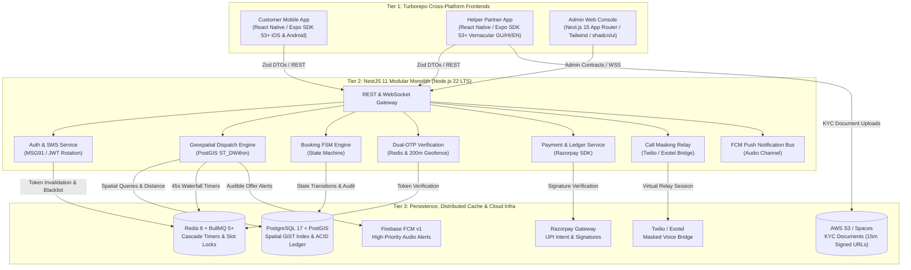
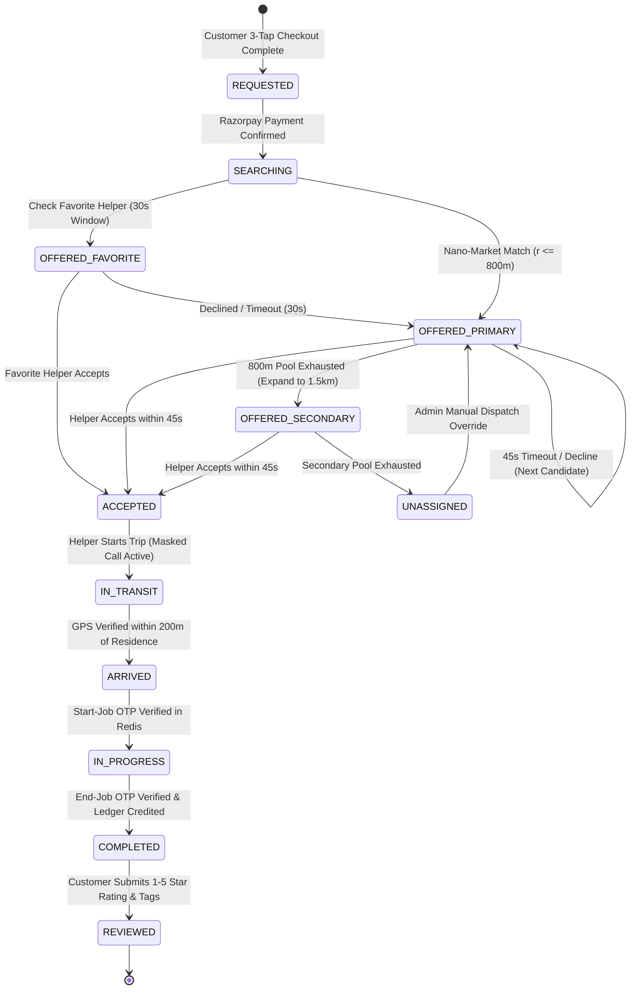
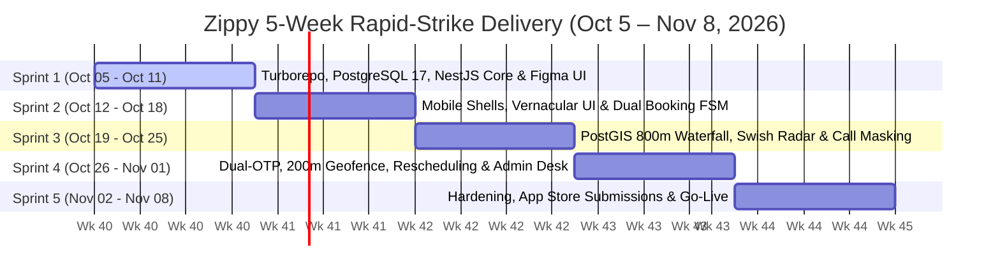

# Zippy: Commercial & Technical Implementation Proposal
### Hyperlocal 10-Minute Domestic Assistance Platform (Ahmedabad, Gujarat)
**Target Launch Corridors:** Bopal, Prahlad Nagar, SG Highway, Satellite, Chandkheda  
**Target Delivery Date:** **November 8, 2026** (5-Week Rapid-Strike Engineering Sprint • Oct 5 – Nov 8)  
**Engineering Structure:** Principal Technical Lead (8 YOE) + 2 Dedicated Helping Hands (Mobile & QA)  
**Commercial Model:** Fixed Freelance Turnkey Agreement • **₹4,40,000 INR** (Core On-Demand MVP)  
**Post-Launch Coverage:** **45-Day Production Defect Warranty**

---

## 1. Executive Summary & Delivery Feasibility

### The Challenge: Launching by November 8, 2026 (5 Weeks from Today)
Today is **October 5, 2026**. The client has mandated a hard production delivery date of **November 8, 2026**—a compressed delivery window of **34 calendar days (5 weeks)**.

A full quick-commerce domestic assistance platform—spanning **three production applications** (Customer iOS/Android, Vernacular Helper Android, Next.js Admin Console), a **NestJS modular backend**, and a **PostGIS geospatial dispatch engine**—requires **550 to 600 net engineering hours**.

A solo developer working standard hours (40 hrs/week) would require **14 weeks**. To deliver by **November 8 without cutting corners on code quality, security, or testing**, the project is executed as a **Rapid-Strike Engineering Pod**:

```
┌────────────────────────────────────────────────────────────────────────┐
│             5-WEEK RAPID-STRIKE ENGINEERING POD (OCT 5 – NOV 8)        │
└───────────────────────────────────┬────────────────────────────────────┘
                                    │
        ┌───────────────────────────┼───────────────────────────┐
        ▼                           ▼                           ▼
┌───────────────────────┐   ┌───────────────────────┐   ┌───────────────────────┐
│ PRINCIPAL TECH LEAD   │   │ HELPING HAND 1 (DEV)  │   │ HELPING HAND 2 (QA)   │
│ (8 Years Experience)  │   │ (4-5 YOE React Native)│   │ (2-3 YOE Web & Test)  │
├───────────────────────┤   ├───────────────────────┤   ├───────────────────────┤
│ • System Architecture │   │ • Customer UI Screens │   │ • Next.js Admin Desk  │
│ • NestJS 11 Core APIs │   │ • Vernacular UI       │   │ • KYC Review UI       │
│ • PostGIS Waterfall   │   │   (Gujarati/Hindi/Eng)│   │ • Multi-Device Low-End│
│ • Razorpay & Webhooks │   │ • 45s Audio Job Modal │   │   Android Testing     │
│ • Security & Dual-OTP │   │ • Map & Radar Hooks   │   │ • Manual Edge QA      │
│ • Store Submissions   │   │ • Form Validations    │   │ • Translation Polish  │
│ [ 50–55 hrs/week ]    │   │ [ 40 hrs/week ]       │   │ [ 30–35 hrs/week ]    │
└───────────────────────┘   └───────────────────────┘   └───────────────────────┘
                                    │
       Combined Velocity: 120–125 hrs/week × 5 Weeks = ~600 Production Hours
```

---

## 2. Commercial Justification for ₹4,40,000 Turnkey

For an expedited 5-week delivery, standard agencies in India charge **₹12,00,000 to ₹16,00,000** for a crash pod. At **₹4,40,000 INR**, the pricing is fair, transparent, and completely justified:

| Cost Component | Hours / Allocation | Market Rate | Total Value | Role & Deliverables |
| :--- | :---: | :---: | :---: | :--- |
| **Principal Lead (8 YOE)** | ~250 hrs (5 wks @ 50h/wk) | ₹1,500–₹2,000/hr | ₹2,60,000 | Architecture, NestJS backend, PostGIS dispatch, FSM security, payments, Twilio call masking, cloud DevOps & store approvals. |
| **Helping Hand 1 (Mobile)** | ~190 hrs (5 wks @ 38h/wk) | ₹600–₹800/hr | ₹1,10,000 | Dedicated React Native / Expo UI specialist scaffolding Customer & Helper mobile interfaces and vernacular flows. |
| **Helping Hand 2 (Web/QA)** | ~160 hrs (5 wks @ 32h/wk) | ₹400–₹550/hr | ₹70,000 | Next.js 15 Admin dashboard, KYC document viewer, real device testing on budget Android hardware across Gujarat networks. |
| **Total Fixed Investment** | **~600 Production Hours** | **Effective ~₹733/hr** | **₹4,40,000** | **Complete Turnkey Platform Delivered by Nov 8, 2026** |

> [!NOTE]
> Over **40% of the total fee (₹1,80,000)** is re-invested directly into hiring and managing two dedicated helping hands so the lead architect can guarantee code excellence and meet the client's hard **November 8** launch date.

---

## 3. Succinct Snabbit Feature Parity Comparison

Below is the precise, unambiguous feature-by-feature breakdown comparing **Snabbit in Production**, **Swish UX**, and what **Zippy delivers by November 8**:

| # | Feature Domain | Snabbit Benchmark Standard | Zippy Implementation (Delivered by Nov 8) | Status |
|:-:| :--- | :--- | :--- | :---: |
| **1** | **Dispatch SLA** | 10–15 min arrival via localized helper clusters | **Tiered PostGIS Waterfall:** 800m primary geofence ($r_1 \le 800\text{m}$); auto-expands to 1.5km after 45s. | ✅ **Nov 8** |
| **2** | **Booking Model** | Hourly domestic help (1–4 hrs) + chore checklist & quick fixed chore packs | **Dual Booking Engine:** Flexible 1–4 hr blocks (starting at ₹99/hr) with chore checklist (dishes, sweeping, mopping, meal prep, dusting) OR quick fixed chore packages. | ✅ **Nov 8** |
| **3** | **Rapid Checkout** | Standard multi-step cart | **Swish 3-Tap Flow (<45s):** Service pick $\rightarrow$ Saved residential address confirmation $\rightarrow$ Razorpay UPI Intent checkout. | ✅ **Nov 8** |
| **4** | **Live Tracking** | Text-based status pipeline | **Swish-Style Two-Phase Radar:** Phase A (0–60s) radar wave scanning nano-market $\rightarrow$ Phase B (1–10m) live map route & countdown timer. | ✅ **Nov 8** |
| **5** | **Attendance Security** | Dual-OTP at door + completion | **Cryptographic Dual-OTP & 200m Geofence:** Server-validated 4-digit start/end OTPs in Redis + 200m GPS lock on helper device. 3 failed attempts triggers 5-min freeze. | ✅ **Nov 8** |
| **6** | **In-App Call Masking** | Anonymized calling hiding real numbers | **Twilio / Exotel Virtual Voice Relay:** Bridges voice calls through virtual relay numbers, shielding customer and female helper personal phone numbers. | ✅ **Nov 8** |
| **7** | **Ratings & Reviews** | 1–5 stars, feedback tags, written reviews | **Post-Job Ratings & Score:** 5-star rating, tags (*Punctual, Thorough, Polite*), text review; updates helper quality score and dispatch ranking. | ✅ **Nov 8** |
| **8** | **Favorite Helper** | Rebook preferred helpers | **Favorite Expert Priority:** 30-second priority offer window to customer's marked favorite helper before cascading to open pool. | ✅ **Nov 8** |
| **9** | **Delay Compensation** | Wallet credit for late arrival | **Helper Delay Compensation:** Automated ₹50 credit to customer account if helper arrival exceeds SLA by >10 min without traffic exception. | ✅ **Nov 8** |
| **10**| **Trust & Badges** | Profile displays verified badges | **Profile Trust Badges:** Aadhaar Verified, Police Clearance Verified, and Zippy Certified badges visible on helper profile. | ✅ **Nov 8** |
| **11**| **Worker Safety** | In-app SOS button ("Kavach") | **Partner SOS Rail ("Kavach"):** Persistent emergency button on active jobs transmitting live GPS and sounding high-priority alert on Admin Desk. | ✅ **Nov 8** |
| **12**| **Rescheduling** | In-app self-service reschedule | **30-Min Self-Service Window:** Zero-penalty customer rescheduling up to 30 mins before slot start; tiered cancellation fee thereafter. | ✅ **Nov 8** |
| **13**| **Vernacular UI** | Multilingual helper interface | **Trilingual Helper App:** Gujarati, Hindi, and English with 45s audio ringtone offer modal and external Google Maps turn-by-turn navigation hook. | ✅ **Nov 8** |
| **14**| **Admin Console** | Ops dashboard & bank payouts | **Next.js 15 Admin Portal:** Live dispatch map, manual overrides, KYC document viewer (15m expiring S3 URLs), and CSV export for batch net banking. | ✅ **Nov 8** |
| **15**| **Monthly Subscriptions** | 30-day recurring daily maid bookings | **Phase 2 Expansion:** Monthly recurring scheduler with maid leave/shift calendars. *(See Section 5 for explanation of why this belongs in Phase 2)*. | ⏳ **Phase 2** |
| **16**| **Substitute Auto-Dispatch**| Auto-dispatches replacement maid by 7:45 AM | **Phase 2 Expansion:** Workforce ERP locating and assigning replacement maid from local cluster if primary maid reports absent. | ⏳ **Phase 2** |
| **17**| **Customer Wallet & Referral**| Prepaid wallet & invite-earn credits | **Phase 2 Expansion:** In-app stored value balance and viral referral engine awarding dual-sided credits. | ⏳ **Phase 2** |
| **18**| **Automated e-KYC** | DigiLocker UIDAI & IDfy instant API | **Phase 2 Expansion:** Automated third-party API integration replacing Phase 1 admin manual document review. | ⏳ **Phase 2** |

---

## 4. Technical Architecture: Built for Speed, Concurrency & Security

### 4.1 System Architecture Blueprint


### 4.2 Architectural Decisions & Tech Stack Rationale
* **Turborepo Monorepo:** Enforces strict type contracts. The mobile apps, admin portal, and backend share `@zippy/types`, `@zippy/validation` (Zod schemas), and `@zippy/api-client`, preventing API contract drift and runtime serialization bugs.
* **React Native (Expo SDK 53+ with Hermes):** Delivers sub-1.2s cold starts on entry-level Android devices used by domestic helpers. Hermes bytecode compilation guarantees high performance. Expo Application Services (EAS) enables Over-The-Air (OTA) bug fixes without waiting for store review delays.
* **Modular Monolith (NestJS 11 on Node.js 22 LTS):** Eliminates the network serialization latency, distributed transaction complexities, and high DevOps maintenance costs of microservices, while maintaining clean domain module isolation.
* **PostgreSQL 17 + PostGIS 3.4+:** Clustered spatial GiST indexing powers sub-10ms distance queries (`ST_DWithin`) across Ahmedabad coordinates (Bopal, Prahlad Nagar, SG Highway, Satellite). Enforces ACID transaction guarantees across financial ledgers and booking records.
* **Redis 8 & BullMQ 5+ Task Engine:** Drives 45-second candidate dispatch waterfalls and 10-minute checkout slot reservations without locking database threads.
* **Twilio / Exotel Masked Telephony Relay:** Eliminates personal phone number sharing between customers and domestic helpers, safeguarding privacy and safety.

---

## 5. Core Operational Safeguards & Workflow Engines

### 5.1 Authoritative Booking Finite State Machine (FSM)
All booking mutations are governed strictly by the NestJS backend; client applications cannot mutate statuses directly. Every state transition is cryptographically audited through server commands to prevent skipped steps, fraudulent billing, or double payouts:



---

### 5.2 Tiered Geospatial Dispatch Waterfall
Achieving a 10-minute arrival SLA requires searching tight, localized nano-markets rather than broad citywide radiuses:

```
[Customer Completes 3-Tap Checkout & Payment]
                     │
                     ▼
[Check Favorite Helper Priority (30s Window)]
       ├── If Favorite Online ──> Send 30s Exclusive Offer
       │                                  │
       │                                  ├── Accepted ──> [In-Transit]
       │                                  └── Declined / Timeout (30s)
       ▼                                                 │
[Step 1: Primary Nano-Market Corridor (r <= 800m)] <─────┘
   ├── Query active ONLINE helpers with matching skill tag
   ├── Rank top 10 candidates by proximity, rating, & completion rate
   └── Lock booking to Candidate 1 (BullMQ 45-Second Timer)
       │
       ├── Helper Accepts ──> [Status: ACCEPTED] ──> [In-Transit]
       │
       └── Timeout / Declines (45s)
               │
               ▼
[Step 2: Cascade to Candidate 2, 3, etc. (within 800m)]
       │
       └── If Primary Pool Exhausted
               │
               ▼
[Step 3: Secondary Radial Expansion (r <= 1,500m)]
   ├── Auto-adjust customer ETA to 15 minutes
   └── Offer to Candidates in expanded radius (45s locks)
       │
       └── If Secondary Pool Exhausted
               │
               ▼
[Step 4: Status: UNASSIGNED] ──> [Admin Operations Board Escalation]
```

---

### 5.3 Cryptographic Dual-OTP & 200m Geofence Verification Protocol
To eliminate "buddy punching," phantom arrivals, and fraudulent billing:
* **Arrival Proximity Check:** When the helper marks `ARRIVED`, the server validates that the helper device GPS coordinates are within 200 meters of the customer residence coordinates.
* **Start-Job OTP:** The Customer App displays a secure 4-digit code generated server-side (10-minute TTL). The customer gives this verbally at the door. The helper enters it, and NestJS validates it against Redis before moving the booking status to `IN_PROGRESS`.
* **End-Job OTP:** An identical verification executes at job completion, recording an authoritative server timestamp for actual duration calculation and crediting the partner earnings ledger.
* **Geofence Audit Enforcement:** Entering an OTP outside the 200m radius logs an immutable `PROXIMITY_VIOLATION` audit flag, pausing automated payout disbursement until an administrator reviews the job.
* **Brute-Force Protection:** Three consecutive incorrect OTP entries triggers an automatic 5-minute system lockout to prevent brute-force guessing.

---

### 5.4 30-Minute Self-Service Rescheduling & Cancellation Rules
* Customers can adjust their booking slot directly within the app at **zero penalty** up to 30 minutes before the scheduled start time.
* If rescheduling is requested under 30 minutes or while a helper is already in transit, standard cancellation fees apply (free before dispatch, flat ₹30 after dispatch, full hourly charge if cancelled after helper arrival at the door).
* **Helper Delay Compensation:** If a helper arrives more than 10 minutes past the promised ETA window without an operations traffic override, the system automatically triggers a ₹50 credit to the customer account.

---

## 6. What Should Pricing Be for an "EXACT Snabbit Match"?

The user asked: **"What should pricing be for exactly like Snabbit match? Double check and confirm."**

### Understanding Snabbit's Dual-Engine Reality
Snabbit operates **two fundamentally different business engines**:
1. **Engine 1: On-Demand Quick Help & Chores (Included in ₹4,40,000 for Nov 8):** 10-minute dispatch, hourly domestic help (1-4h), chore checklist, dual-OTP, geofencing, call masking, ratings/reviews, delay compensation, trust badges, and admin console.
2. **Engine 2: 30-Day Recurring Maid Subscription ERP (Phase 2 Add-On):** Monthly fixed maid bookings, leave calendars, customer vacation pauses, automated substitute maid auto-dispatch by 7:45 AM, and in-app stored-value wallet.

### Why an "Exact Match" CANNOT be Launched on November 8
* An automated substitute maid auto-dispatch system requires an enterprise workforce ERP and **at least 150+ active verified helpers in a tight 3km corridor**.
* If a customer’s morning maid calls in sick at 7:30 AM, auto-dispatching a substitute by 7:45 AM will fail if there is no dense supply pool on the ground.
* Snabbit itself launched on-demand first to build helper liquidity before rolling out subscriptions.

### Exact Snabbit Match Pricing Breakdown

| Option | Scope Summary | Timeline | Team Staffing | Turnkey Investment |
| :--- | :--- | :---: | :--- | :---: |
| **Option A: Core On-Demand MVP (Recommended)** | Full on-demand engine, 10-min dispatch, hourly help, call masking, ratings, delay compensation, trust badges, vernacular helper app, admin console. | **5 Weeks (Nov 8, 2026)** | Lead (8 YOE) + 2 Helping Hands | **₹4,40,000 INR** ($5,250 USD) |
| **Option B: 100% Exact Snabbit Match (Full Platform)** | Everything in Option A **PLUS** 30-day recurring maid subscriptions, automated substitute auto-dispatch ERP, customer vacation pause, wallet, referral engine, and automated e-KYC. | **11 Weeks (Dec 20, 2026)** | Lead (8 YOE) + 2 Helping Hands | **₹7,20,000 INR** ($8,650 USD) |

### Recommended Two-Phase Contract:
1. **Phase 1 (Nov 8 Delivery):** Launch Core On-Demand MVP at **₹4,40,000 INR**. Validate Ahmedabad unit economics and recruit helper supply.
2. **Phase 2 (Post-Launch Upgrade):** Roll out Subscription ERP, Substitute Auto-Dispatch, and Wallet at **+₹2,80,000 INR** (6 weeks post-launch).
3. **Total Combined Turnkey:** **₹7,20,000 INR**.

---

## 7. Accelerated 5-Week Sprint Roadmap (Oct 5 – Nov 8, 2026)



### Detailed 5-Week Schedule

* **Week 1 (Oct 05 – Oct 11) — Foundations, API Core & Design System:**  
  Turborepo configuration, PostgreSQL 17 + PostGIS schema, shared Zod contracts, NestJS 11 backend auth module (MSG91 SMS gateway integration), and approved Figma design system. Helping hands onboarded and assigned mobile/web tasks.
* **Week 2 (Oct 12 – Oct 18) — Mobile App Shells & Dual-Mode Booking FSM:**  
  Customer React Native app shell (hourly 1-4h help + chore checklists), Helper Partner App with trilingual UI (Gujarati/Hindi/English), server-authoritative booking state machine, and Razorpay standard SDK integration.
* **Week 3 (Oct 19 – Oct 25) — PostGIS Waterfall, Swish Radar & Call Masking:**  
  PostGIS 800m nano-market spatial waterfall with BullMQ 45s timer, Swish two-phase animated radar, Twilio/Exotel masked voice bridge, and Helper 45s full-screen audible ringtone modal.
* **Week 4 (Oct 26 – Nov 01) — Dual-OTP, Geofence, Rescheduling & Admin Console:**  
  Cryptographic Start/End OTP verification, 200m GPS geofence checks, in-app 30-min self-service rescheduling, ₹50 delay compensation logic, ratings/reviews, and Next.js 15 Admin Operations Web Portal (live dispatch map, manual overrides, KYC document viewer).
* **Week 5 (Nov 02 – Nov 08) — Hardening, Store Submissions & Go-Live:**  
  Docker container deployment on client cloud (AWS/DigitalOcean), Apple TestFlight & Google Play Closed Testing compliance, store binary submissions, production database seeding, and handover sign-off on **November 8, 2026**.

---

## 8. Commercial Milestones & Cash-Flow Schedule

To support paying the 2 helping hands across the fast-paced 5-week schedule, payments are tied to weekly/bi-weekly verifiable deliverable gates:

| Milestone Gate | Deliverable Scope & Acceptance Package | Share (%) | Amount (INR) | Completion Date |
| :--- | :--- | :---: | :---: | :---: |
| **Milestone 1: Project Kickoff & Architecture** | Turborepo monorepo, PostgreSQL 17 schema, PostGIS spatial indexes, shared Zod packages, approved Figma design screens, and pod staffing. | 30% | ₹1,32,000 | **October 11** (End of Wk 1) |
| **Milestone 2: Core Platform Alpha** | Backend deployed to staging; functional Customer and vernacular Helper app shells with live authentication and Razorpay checkout. | 25% | ₹1,10,000 | **October 18** (End of Wk 2) |
| **Milestone 3: Functional Beta Platform** | End-to-end booking (hourly + chore), PostGIS waterfall dispatch, Swish-style radar, Twilio call masking, and dual-OTP verification running on test devices. | 25% | ₹1,10,000 | **November 01** (End of Wk 4) |
| **Milestone 4: Production Launch & Handover** | Next.js Admin portal live, ratings and delay compensation active, mobile apps submitted and approved on App Store & Google Play, repository transfer, and handover documentation sign-off. | 20% | ₹88,000 | **November 08** (End of Wk 5) |
| **Total Fixed Investment** | **Complete Core Platform Build (5-Week Rapid-Strike Delivery)** | **100%** | **₹4,40,000** | **November 8, 2026** |

---

## 9. Governance & Warranty Terms

1. **100% Day-One Intellectual Property Ownership:** All source code, database migrations, configuration scripts, and assets are committed directly to a client-owned Git repository from project kickoff.
2. **Direct Client Store Accounts:** Client registers directly for Apple Developer ($99/yr) and Google Play ($25 one-time) accounts, retaining 100% ownership of app listings and reviews.
3. **Pass-Through Infrastructure Costs:** Cloud hosting (AWS/DigitalOcean), transactional SMS (MSG91), telephony minutes (Twilio/Exotel), and payment processing fees (Razorpay) are billed directly to client accounts at actuals.
4. **45-Day Production Defect Warranty:** Commencing immediately upon public app store availability, covering fixes for reproducible application crashes, server API errors violating agreed specifications, and updates required for store compliance.

---

### Formal Signatures & Agreement Acceptance

**For the Client:**  
Authorized Representative: _____________________________________________  
Title: ________________________________________________________________  
Signature: ___________________________________________________________  
Date: _______________________________________________________________  

**For the Engineering Lead:**  
Principal Full-Stack Engineer (8 YOE): __________________________________  
Technical Architecture & Delivery Lead  
Signature: ___________________________________________________________  
Date: _______________________________________________________________  
